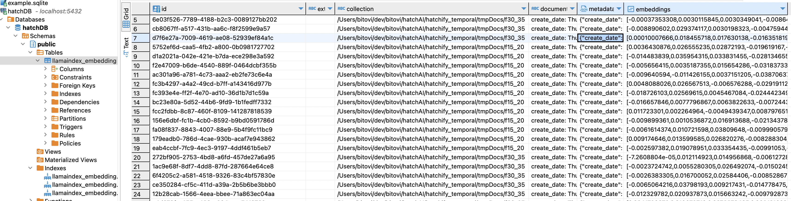

# Temporal AI workflow

The following is a simplified sample Temporal workflow to create custom embeddings from large list of files for use in an LLM-based application.

## Installing and running dependencies

This repo contains a simple local development setup. For production use, we would recommend using Temporal Cloud and AWS.

Use the following command to run everything you need locally:

- Localstack (for storing files in local S3)
- Postgres (where embeddings are stored)
- Temporal (runs `temporal server start-dev` in a docker container)
- A Temporal Worker (to run your Workflow/Activity code)

```bash
OPENAI_API_KEY=<your OpenAI key> docker compose up --build -d
```

See [these instructions](#obtain-an-openai-api-key) if you need an OpenAI key.

## Tearing everything down

Run the following command to turn everything off:

```bash
docker compose down -v
```

## Create embeddings

```bash
npm run process-documents
```

Generated embeddings are stored in a Postgres table:



## Invoke a prompt

```bash
npm run invoke-prompt <embeddings workflowID> "<query>"
```

## Test a prompt

```bash
npm run test-prompt <embeddings workflowID>
```

## More info

This repo was created for demonstrating concepts outlined in the following articles.

- [Part 1 - Document Processing](https://www.bitovi.com/blog/your-next-ai-startup-should-be-built-on-temporal-part-1-document-processing)
- [Part 2 - Prompt Engineering](https://www.bitovi.com/blog/your-next-ai-startup-should-be-built-on-temporal-part-2-prompt-engineering)
- [Part 3 - Automated Prompt Testing](https://www.bitovi.com/blog/your-next-ai-startup-should-be-built-on-temporal-part-3-automated-prompt-testing)

## Obtain an OpenAI API key

To run this project, you will need an OpenAI API key.  If you already have an OpenAI account, you can setup a project and API key [on the OpenAI Settings page](https://platform.openai.com/settings/). If you don't have an account, you can sign up at [OpenAI](https://platform.openai.com/signup).  You'll need to perform two main steps to run this project:

1. To create an API key, create a project, first, then open the API Keys page from the left sidebar and create a new key.
2. Open the `Limits` page for the new project and select the following models:
   - `gpt-3.5-turbo`
   - `text-embedding-ada-002`
   - `gpt-4-turbo`

Once you've setup your API key and models, you'll be ready to run the project.  Note that sometimes it can take up to 15 minutes for the model selections to apply to your API key.
